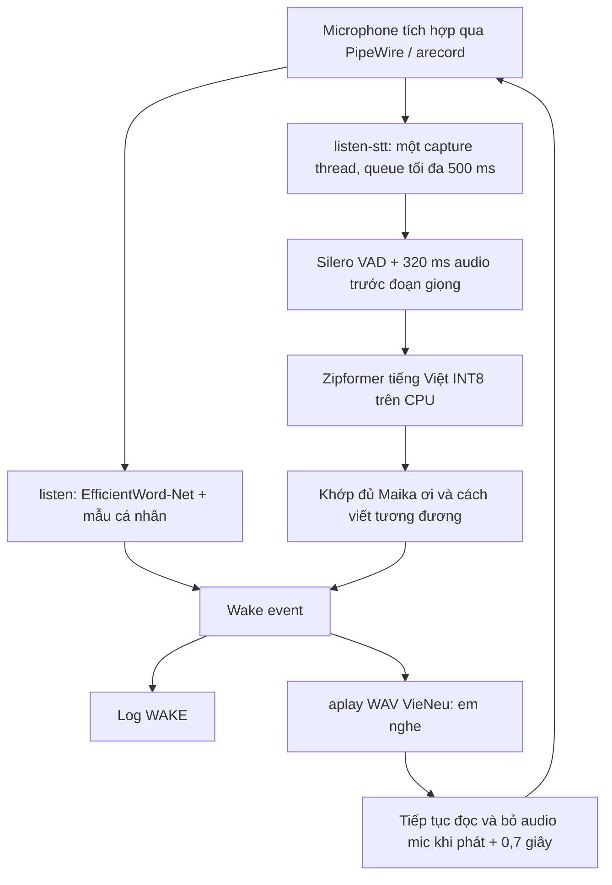
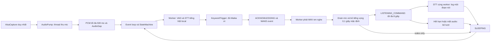
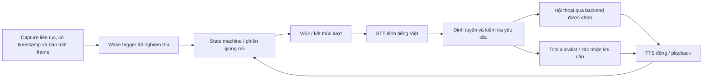

# Kiến trúc hiện tại và hướng phát triển

## Đã triển khai: wake và phản hồi cố định

Hai lệnh là hai lựa chọn, không chạy đồng thời trên cùng mic. Cả hai chỉ phát
event/tiếng đáp. Không xử lý command sau wake. WAV đã có sẵn, không nạp TTS
động trong listener. Runtime không gọi mạng hoặc mở cổng dịch vụ.

`listen` giữ mẫu neural cá nhân và WakeGate. `listen-stt` dùng final transcript
với `KeywordTrigger`, không cần enrollment; các mẫu trong config của `listen`
không chi phối STT. Tất cả alias mặc định của Maika đều chứa `ơi`, giữ dấu,
khớp theo ranh giới từ, có dedup kết quả cuối và cooldown.

## Thành phần của bản STT

| File | Trách nhiệm |
| --- | --- |
| `audio.py` | Chủ sở hữu subprocess arecord, PCM mono 16 kHz/20 ms, timeout và đóng pipe |
| `capture_pump.py` | Một thread sở hữu capture, queue tối đa 25 frame, lỗi độc lập với queue; quá tải dừng FAIL |
| `local_stt.py` | Nạp model CPU đã xác minh, nối frame 320 → 512 sample, VAD, history tối đa 8 s và STT từng đoạn |
| `stt_keyword.py` | So khớp transcript cuối, alias có kiểm soát, chống lặp, tạo WakeEvent |
| `stt_wake.py` | Điều phối VAD/STT, clipping, suppression loa, thống kê và kết thúc bài thử |
| `feedback.py` | Phát WAV bằng aplay, phát hiện lỗi/timeout và guard tiếng vọng |
| `stt_assets.py` / `download_stt_models.py` | Manifest SHA-256, kiểm tra file local / tải model khi được gọi rõ ràng |

STT đồng bộ ở luồng xử lý, capture chạy ở thread riêng. Queue đầy hoặc chậm
quá 500 ms là lỗi kết thúc phiên, không âm thầm bỏ frame rồi nhận tiếp. Đây
là chính sách của bản thử, chưa phải AudioPump async phục hồi mất frame trong
Phase 1. Timestamp queue là lúc đọc frame, chưa phải timestamp phần cứng ALSA.
Chưa có đo độ trễ từ miệng người nói tới loa trong điều kiện sử dụng thật.

## Runtime Phase 1: `assistant`

`audio_pump.py` là đường thu mới của `assistant`. Khi đầy, bỏ frame cũ nhất,
gộp `AudioGap`, giữ offset sample tuyệt đối và tăng mã continuity. Chỉ một
thông báo đánh thức loop có thể chờ xử lý. Gap và lỗi capture không bị kẹt
trong queue PCM; lỗi được công bố trước khi đóng subprocess.

`worker.py` chạy một tác vụ tại một thời điểm, không xếp thêm tác vụ khi bận.
`assistant.py` đối chiếu session/generation/continuity và sequence trước khi
nhận kết quả; sau gap hoặc playback phải reset VAD. Hai worker dành riêng cho
model và loa giữ thao tác blocking khỏi event loop. `state.py` giới hạn vòng
sleeping → acknowledging → listening_command → sleeping, cộng trạng thái
lỗi/dừng. `--wake-only` bỏ bước listening_command. Lệnh dùng lại model STT
và worker; VAD riêng cho lệnh ngắn được tạo từ file Silero sẵn có, chỉ một
VAD được cấp audio tại mỗi thời điểm. Đổi chế độ sẽ reset lịch sử audio;
thông số VAD wake khôi phục theo profile đã chọn. `standard` giữ mức cũ,
`sensitive` thử giọng nhỏ/ngắn. Thông số lệnh nằm trong `COMMAND_*` ở
`local_stt.py`, gồm ngưỡng 0,35, giọng tối thiểu 0,10 giây, im lặng kết câu
0,80 giây và pre-roll 0,64 giây.
VAD/STT lệnh dùng bản sao audio được nâng mức tối đa 8 lần, có giới hạn
peak; PCM gốc vẫn được giữ để kiểm tra clipping. Wake `standard` không
khuếch đại; `sensitive` tối đa 4 lần. VAD lệnh được nạp trước capture,
không tạo khi nhận frame lệnh đầu. Không sửa transcript theo nội dung đoán.

Trong listening_command, transcript cuối đầu tiên không rỗng phát một
`CommandRecognized` và `[COMMAND] ...`; wake matching tạm ngừng. Deadline
riêng hoạt động cả khi không có frame mới. Lượt có clipping hoặc mất audio
bị hủy để tránh log câu thiếu như lệnh hoàn chỉnh. Timeout, dừng và kết thúc
lượt đều vô hiệu hóa kết quả cũ. Chưa có router hoặc thực thi nội dung này.

Timestamp là lúc thread đọc xong frame, không phải thời gian phần cứng ALSA.
Frame trong playback, hàng đợi cũ và frame sát biên kết thúc guard đều bị bỏ.
Sau tiếng đáp, khoảng bỏ frame sát biên 20 ms hoàn tất trước LISTEN COMMAND/READY,
để không bỏ frame của đầu câu nói sau thông báo sẵn sàng.
Runtime mới không dùng WakeGate của neural; bộ test WakeGate/`listen` cũ vẫn
giữ quy tắc audio bị bỏ không được coi là silence để rearm.

Chi tiết kiểm thử, deadline và giới hạn: [runtime-phase1.md](runtime-phase1.md)
và [command-transcript.md](command-transcript.md).
Chỉ chạy một trong ba lệnh nghe cùng lúc. Không thêm dependency, tải model
trong runtime, mở cổng hoặc thay cấu hình audio hệ thống.

## Phase 2: thu lượt hội thoại

`assistant --capture-only` dùng `turn_vad.py` cho xác suất Silero local và
`turn.py` làm chủ toàn bộ quyết định bắt đầu/kết thúc/hủy lượt. Model chạy
trên worker cũ; controller trên event loop giữ PCM giới hạn trong RAM, thời
gian chờ nói và thời lượng tối đa. Timer runtime chỉ gọi `poll()` tại deadline
do controller cung cấp; không có VAD hoặc timer chốt câu thứ hai.

Sau đáp/guard: `LISTENING_TURN` → `UserTurnReady` → `SLEEPING`. Timeout,
mất frame và clipping không tạo lượt hoàn chỉnh. `--debug-recordings` thêm
`SAVING_TURN` để ghi WAV riêng ở worker rồi mới trở về READY. Mặc định không
tạo recorder. Thông số/kiểm chứng: [turn-capture.md](turn-capture.md).

## Dự kiến trong plan, chưa triển khai

**Quyết định Phase 1B, 2026-09-15:** lượt hội thoại sẽ do **một turn
controller local của Smart Hub** sở hữu, dùng Silero ONNX đang có.
`AudioPump`/worker tiếp tục giữ nguồn PCM và công việc blocking. Pipecat
được thử riêng và hoãn do chi phí dependency cùng xung đột hai core pin.
[Quyết định và kiểm chứng](decisions/conversation-orchestration.md).
Sơ đồ sau vẫn là kiến trúc mục tiêu; Phase 2 đã có chế độ capture-only,
các bước xử lý/hội thoại sau lượt nói chưa tích hợp.

Phải kiểm chứng lại backend, CPU, lifecycle, queue/gap, cancellation và độ trễ
trước khi dùng các phần thử nghiệm cho assistant. Việc có `listen-stt` không
có nghĩa Phase 2/3 về thu lệnh/hội thoại đã xong. Trạng thái các phase và thay
đổi yêu cầu: [SMART_HUB_PLAN.md](SMART_HUB_PLAN.md).
